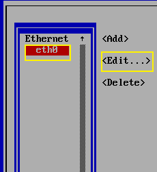
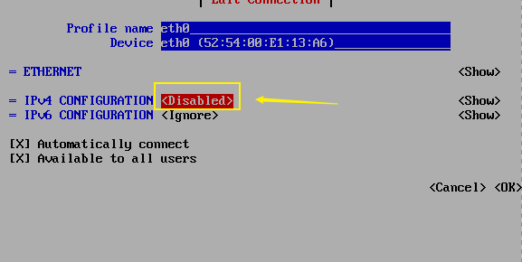
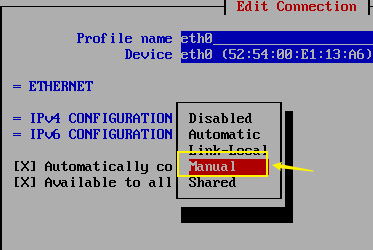
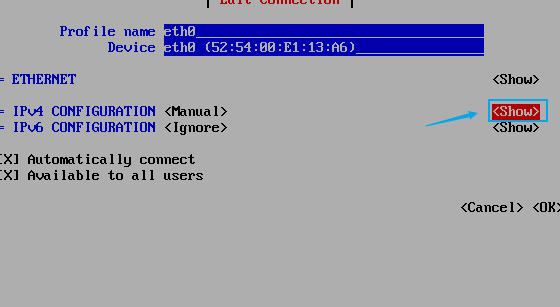
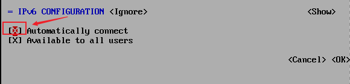
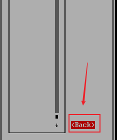
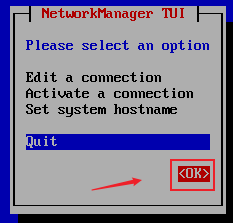

此题解配合达内提供实验环境使用，仅作为参考，不作为标准答案提供。


# 实验环境与注意事项

实验环境为 VMware 虚拟机一台。内部已配置好实验环境。

如需内外访问，需打开宿主机系统 `VMnet1` 并分配 IP 地址为 `172.25.0.200/24`

在虚拟机中 ( 以下将统称为 `Server1` )，使用 `rht-vmctl reset` 命令重置实验环境。

对本题 ( 即 `EX200` )，涉及到的主机为 `red` 与 `blue`，即：

```shell
rht-vmctl reset red # 重置 red 环境
rht-vmctl reset blue # 重置 blue 环境
```

之后打开 Virt Manager 即可操作实验机 ( 以下将称为 `red` 与 `blue` )

可在 `GNOME` 桌面环境中直接打开，也可在终端中输入

```shell
virt-manager
```

下面将不重复写出题目需求。

# Red

```bash
localhost login： # 提示登录，输入用户名是：root
Password：# 提示输入密码，密码是：redhat
```

## 配置网络地址

```bash
ip a s # (ip address show,查看网卡和对应的IP)
```

在Linux中网卡的名称一般为 `eth0`, `eth1`, `eth2(ethernet)`，有时网卡名也可能是`ens33`、`ens36`。

### `nmtui` 配置 `IP` 的工具


选`Edit a connection`回车



选择需要配置IP的网卡名称,如 `eth0`，再选择右边的 `Edit`（结合左右键和上下键），回车



上下键选择IPv4后面的回车.



选择 `Manual` (手动配置IP)，回车



方向机选择右边的 `show` 回车

`Addrees`（IP 地址），点击 Add 回车即可添加 IP

`Gateway`（网关），直接输入

`DNS servers`（DNS 域名解析服务器），点击 Add 回车即可添加服务器 IP

在实验环境：

`IP`：`172.25.0.25/24` （24就是子网掩码255.255.255.0)

`Gateway`: `172.25.0.254` (`server1`是网关）

`DNS`：`172.25.0.254` （`server1`是`DNS`服务器）



一定勾选  ( 使用空格选择，或者取消选择 )

`Automatically connect`在计算机启动的时候要不要把网卡自动激活，

最后选择 `OK`



选择下面的 `Back` 返回



最后选择 `OK`

在 `Server1` 上面 ping 一次 `red` 测试网络是否已经联通：

```bash
ping -c 4 172.25.0.25
```

## 配置默认软件仓库

```bash
ls /etc/yum.repos.d/ # 没有yum源
vim /etc/yum.repos.d/rhel.repo # 新建文件，文件名任意，扩展名为repo
```

默认在命令模式，无法编辑文件，需要输入i键，进入编辑模式，手动输入如下内容:

```
[BaseOS]
name=BaseOS
baseurl=http://server1.net0.example.com/rhel8/BaseOS
gpgcheck=0

[AppStream]
name=AppStream
baseurl=http://server1.net0.example.com/rhel8/AppStream
gpgcheck=0
```

验证：

```bash
yum clean all # 清理缓存
yum repolist # 查看yum源有几个，输出出来
```

## 调试 SELinux

实质上这道题是配合非常规配置时对 SELinux 进行配置

### 配合非正常端口

需要 `semanage` 程序，如果没有预装，需要安装此包。

```bash
# 查询哪一个软件包包含此软件
yum provides semanage
# 安装 policycoreutils-python-utils
yum install -y policycoreutils-python-utils
```

此例子为放行 `82` 号端口

```bash
semanage port -a -t http_post_t -p tcp 82
```

之后查看配置

```bash
semanage port -l | grep http_port_t
```

之后可以启动 httpd 服务

```bash
systemctl httpd start
```

检查 SELinux 工作状态

```bash
getenforce
```

### 扩展项目：配合非默认目录

配合非默认目录需要修改 SELinux 安全上下文。

如，要将 Web 根目录修改为 `/var/test_www/html/`.

- 修改 SELinux 类型与默认的 `/var/www/html/` 相同

```sh
semanage fcontext -a -e /var/www /var/test_www
```

- 重新设定 `/var` 目录标签

```sh
restorecon -Rv /var/
```

以上

检查 `httpd` 服务与连接状态

```sh
systemctl status httpd

curl localhost:82
```

> 参考：[RHEL8 Documents: Use SELinux: Cheaper 4 . CONFIGURING SELINUX FOR APPLICATIONS AND SERVICES WITH NON-STANDARD CONFIGURATIONS](https://access.redhat.com/documentation/en-us/red_hat_enterprise_linux/8/html/using_selinux/configuring-selinux-for-applications-and-services-with-non-standard-configurations_using-selinux#customizing-the-selinux-policy-for-the-apache-http-server-in-a-non-standard-configuration_configuring-selinux-for-applications-and-services-with-non-standard-configurations)

## 配置用户账户

创建一个新用户，用户名为tammy，指定ID为2020

```shell
useradd -u 2020 tammy
```

其中 `-u` 参数指定新建用户的 `UID`

为tammy用户设置密码

```shell
passwd tammy
```
注：passwd 生效时，会提示New UNIX password： ，输入题目要求（ilovelinux）并Retype一遍即可生效。

扩展部分：

给出另一种方法设置密码，使用 `--stdin` 参数指定 `passwd` 命令从标准输入读入内容来设置密码。

因此使用 `echo` 将要设定的密码字符串输出至标准输入，并利用管道符使其作为 `passwd` 命令的输入。

```shell
echo ilovelinux | passwd tammy --stdin
```

## 创建用户账户

按照需求，对用户和组进行创建

```bash
groupadd admins
useradd zhsan -g admins
useradd lisi -g admins
useradd wangwu -s /sbin/nologin 
```

其中 `-g` 参数指定创建用户代表的主要组

`-s` 命令代表用户登录 Shell

禁止用户登录需要指定为 `/sbin/nologin`

接下来可以普通的使用 `passwd` 更改密码，如下：

```console
$ passwd zhsan
New UNIX password：ilovelinux
$ passwd lisi
New UNIX password： ilovelinux
$ passwd wangwu
New UNIX password：ilovelinux
```

也可以：

```bash
echo ilovelinux | passwd zhsan --stdin
echo ilovelinux | passwd lisi --stdin
echo ilovelinux | passwd wangwu --stdin
```

## 配置 `cron` 计划任务

编辑 `cron` 计划

```bash
crontab -e -u zhsan
```

e代表编辑计划任务，-u代表指定用户

此处注意，题目要求以 `zhsan` 用户执行任务，而**不是**用`root` 账户执行任务！

此命令执行后会打开默认编辑器 ( 即 `vim` )

按 `i` 进入插入模式，输入一行

```
5 * * * * logger "RH200 Test"
```

对应分别为：分 小时 日 月 星期 命令 

按 `ESC` 返回命令模式，`:wq` 保存退出。

*扩展：可将计划任务写进 `/etc/crontab` 中，此文件保存系统级计划任务，需要额外增加执行的用户名。也可写进 `/var/spool/cron/` 下对应用户的文件中。*

## 配置文件权限

分析题目，我们需要做几件事情：

- 复制所需文件
- 设置文件的所属用户与所属组
- 确定所有用户没有执行权限
- 确定其他用户 ( `o` 权限组) 具有读写权限
- 按需求对两个用户配置 `ACL`

来看命令

```bash
cp /etc/hosts /var/tmp/hosts
```

查看一下文件权限：
```console
$ ls -l /var/tmp/hosts
-rw-r--r--. 1 root root 782 Dec 10 21:35 /var/tmp/hosts
```

当前所属用户与组已经为 `root` 其实无需修改，如要修改，使用 `chown` 命令：

```sh
chown root:root /var/tmp/hosts
```

当前权限为644，对于题目需求也无需修改，所有用户均无执行权限，且其他用户有读权限。

对于两条针对用户的特殊权限需要配置两条 `ACL`

```sh
setfacl -m u:zhsan:6 /var/tmp/hosts
setfacl -m u:lisi:0 /var/tmp/hosts
```

查看权限：

```console
[root@red ~]# ls -l /var/tmp/hosts
-rw-rw-r--+ 1 root root 782 Dec 10 21:35 /var/tmp/hosts
[root@red ~]# getfacl /var/tmp/hosts
getfacl: Removing leading '/' from absolute path names
# file: var/tmp/hosts
# owner: root
# group: root
user::rw-
user:zhsan:rw-
user:lisi:---
group::r--
mask::rw-
other::r--
```

## 创建公用目录

首先按要求创建目录

```sh
mkdir /home/tools
```

将其所属组更改为 `admins`

```bash
chgrp admins /home/tools
```

当前权限应为

```console
[root@red ~]# ls -ld /home/tools
drwxr-xr-x. 2 root admins 6 Dec  9 14:57 /home/tools
```

分析当前权限可得，当前 `root` 用户可读可写可访问，所属组可读可访问，其他用户可读可访问。

需要分配的权限为`drwxrwx---` 即对组可读写可访问，并取消对其他用户的权限。根据数字模式计算可得 `770` 。因此执行：

```bash
chmod 770 /home/tools
```

再次查看，当前权限为：

```console
[root@red ~]# ls -ld /home/tools
drwxrwx---. 2 root admins 6 Dec  9 14:57 /home/tools
```

将在此目录下创建的文件默认设置为此组，需要设置 `SetGID` 权限

```sh
chmod 2770 /home/tools
```

权限变为：
```console
[root@red ~]# ls -ld /home/tools
drwxrws---. 2 root admins 6 Dec  9 14:57 /home/tools
```

#### 扩展知识：`SetUID` 与 `SetGID`

如果你使用过一阵 Linux ，你一定对 `sudo` 命令不感到陌生。`sudo` 命令相当于临时提权至 `root` 用户执行程序。`SetUID` 与 `SetGID` 在理解上与 `sudo` 有相似之处。

`SetUID` 与 `SetGID` 是一种特殊权限，对于文件来说，它意为：当用户拥有可执行这个文件的权限时，自动使用所属用户 ( 或组 ) 的特权来执行文件。

而对于目录来说，当设定 `SetGID` 权限时，则意为：当用户创建新文件或子目录时，将文件和子目录的所属组置为当前目录设定的所属组。

**一般对于目录是不能设定 `SetUID` 权限的!**

`SetUID` 与 `SetGID` 有其指定的标识符，为 `s` 权限。可以使用 `u+s` 或 `g+s` 的方式设定。

`SetUID` 与 `SetGID` 也有其数字表示法，如：

当前有一文件 `test.txt`权限为：`-rw-r--r--` 即默认的`644` 权限。

对此文件指定 `SetUID` 权限为

```bash
chmod 4644 test.txt
```

而 `SetGID` 为：

```bash
chmod 2644 test.txt
```

若指定两者，加起来即可，即为：

```bash
chmod 6644 test.txt
```

> 参考：[WikiPedia:Setuid](https://en.wikipedia.org/wiki/Setuid)
>
> manpage: chmod

## 配置 `NTP` 时间客户端

安装 `chrony` 软件包

```sh
yum install chrony
```

修改配置文件 `/etc/chrony.conf`

```sh
vim /etc/chrony.conf
```

在开头第 3 行，仿照写法新建一行，填入：

```
server server1.net0.example.com iburst
```

启动服务

```sh
systemctl enable chronyd
systemctl restart chronyd
```

查看时间状态

```sh
timedatectl status # 查看时间同步状态与时区等信息
chronyc sourcestats # 查看 NTP 服务器状态
```

示例：
```console
[root@red ~]# timedatectl status
               Local time: Thu 2020-12-10 22:52:03 CST
           Universal time: Thu 2020-12-10 14:52:03 UTC
                 RTC time: Thu 2020-12-10 14:52:03
                Time zone: Asia/Shanghai (CST, +0800)
System clock synchronized: yes
              NTP service: active
          RTC in local TZ: no
[root@red ~]# chronyc sourcestats
210 Number of sources = 5
Name/IP Address            NP  NR  Span  Frequency  Freq Skew  Offset  Std Dev
==============================================================================
time.cloudflare.com         7   4   206     -4.223     53.666    +27ms  2057us
139.199.214.202             7   5   201     +3.024     45.744  +1663us   845us
ntp5.flashdance.cx          6   5   208    +15.205     46.942    -14ms   980us
stratum2-1.ntp.led01.ru.>   6   5   141    +93.992    127.219    +30ms  2253us
server1.net0.example.com    7   3   199     -0.043      1.802  -1184us    47us
```

> 注：此处实验环境接通互联网，局域网环境中可以将配置文件中原配置注释掉，加快速度

## 配置 `autofs`

此题需要处理自动挂载与 `NFS` 共享

需要安装 `nfs-utils` 与 `autofs` 软件包

```sh
yum install nfs-utils autofs
```

可以使用 `showmount` 查看挂载信息

```console
[root@red ~]# showmount -e 172.25.0.254
Export list for 172.25.0.254:
/rhome *
```

可以尝试进行手动挂载，但无论如何要先创建挂载点：

```sh
mkdir /rhome # 创建挂载点的父目录
```

接下来编辑 `/etc/auto.master` 文件

```sh
vim /etc/auto.master
```

在第 7 行原位置，仿照原配置在下面新建一行，输入要挂载的父目录位置与要创建的配置文件：

```
/rhome    /etc/rhome.misc
```

保存退出，创建 `/etc/rhome.misc`

```sh
vim /etc/rhome.misc
```

输入一行：

```
ldapuser0    -fstype=nfs    172.25.0.254:/rhome/ldapuser0
```

分别为：要挂载的目录，文件系统类型，与挂载设备，此处为通过 `NFS` 挂载

启动 `autofs` 服务

```sh
systemctl start autofs
```

切换至 `ldapuser0` 用户验证配置

```sh
su - ldapuser0 # 无需退出登录，直接切换至目标用户
```

查看自动挂载效果与权限

```console
[root@red ~]# systemctl start autofs
[root@red ~]# ls -l /rhome/
total 0
[root@red ~]# su - ldapuser0
Last login: Thu Dec 10 22:36:58 CST 2020 on pts/0
[ldapuser0@red ~]$ ls -l /rhome
total 0
[ldapuser0@red ~]$ cd /rhome
[ldapuser0@red rhome]$ ls
[ldapuser0@red rhome]$ cd ldapuser0
[ldapuser0@red ldapuser0]$ ls -ld
drwx------. 2 ldapuser0 ldapuser0 62 Nov 22 01:30 .
[ldapuser0@red ldapuser0]$ mount
... 省略部分输出
172.25.0.254:/rhome/ldapuser0 on /rhome/ldapuser0 type nfs4 (rw,relatime,vers=4.2,rsize=1048576,wsize=1048576,namlen=255,hard,proto=tcp,timeo=600,retrans=2,sec=sys,clientaddr=172.25.0.25,local_lock=none,addr=172.25.0.254)
```

## 查找文件

使用一条命令来完成。

`find` 命令可对查找到的内容执行命令。

```bash
find /etc/ -size +5M -type f -exec cp {} /root/findfiles \;
```

这条命令需要详细解释。

`-size` 参数代表查找筛选条件为文件大小。 `+5M` 代表大于 5M
其他类似参数有 `-name` (查找文件名), `-iname` (查找文件名并忽略大小写) `-type` (查找文件类型)等，一共有二三十种。

`-type f` 代表查找一般文件

`-exec` 命令代表对查找到的文件作为后面的命令参数执行。

其中 `{}` 代表被查找到的文件，命令结束需要加 `;` 结尾，为防止歧义需要对 `;` 进行转义，因此加 `\;`

> 建议阅读资料：[Linux Find 命令精通指南](https://www.oracle.com/cn/technical-resources/articles/linux-calish-find.html)

## 查找字符串

查看 `/etc/man_db.conf` 文件下带 `sbin` 字符串的所有行，将查找结果存到 `/root/out.txt` 里

```sh
cat /etc/man_db.conf | grep sbin > /root/out.txt
```

## 创建归档

根据题意，创建一个名为backup.tar.bz2的归档，使用bzip2进行压缩，压缩包内含有 `/usr/local` 的内容

```sh
tar -cjvf /root/backup.tar.bz2 /usr/local/
```

注：

没有打包压缩命令的需要安装bzip和tar命令

```sh
yum -y install tar bzip2
```

## 配置容器服务

## 为容器配置持久存储

# Blue

## 设置 `root` 密码


## 创建逻辑卷

```console
[root@blue ~]# lsblk
NAME          MAJ:MIN RM  SIZE RO TYPE MOUNTPOINT
sr0            11:0    1 1024M  0 rom  
vda           252:0    0   50G  0 disk 
|-vda1        252:1    0    1G  0 part /boot
`-vda2        252:2    0   49G  0 part 
  |-rhel-root 253:0    0 46.9G  0 lvm  /
  `-rhel-swap 253:1    0  2.2G  0 lvm  [SWAP]
vdb           252:16   0   10G  0 disk 
`-vdb1        252:17   0  200M  0 part 
  `-test-vo   253:2    0  196M  0 lvm  /vo
vdc           252:32   0   10G  0 disk

[root@blue ~]# fdisk /dev/vdb

Command (m for help): n    
Partition type
   p   primary (1 primary, 0 extended, 3 free)
   e   extended (container for logical partitions)
Select (default p): p
Partition number (2-4, default 2): 
First sector (411648-20971519, default 411648): 
Last sector, +sectors or +size{K,M,G,T,P} (411648-20971519, default 20971519):^[+200M 

Created a new partition 2 of type 'Linux' and of size 200 MiB.

Command (m for help): w
The partition table has been altered.
Syncing disks.

[root@blue ~]# vgextend /dev/test /dev/vdb2
  Physical volume "/dev/vdb2" successfully created.
  Volume group "test" successfully extended
  
[root@blue ~]# lvextend -L 300M /dev/test/vo
Size of logical volume test/vo changed from 196.00 MiB (49 extents) to 300.00 MiB (75 extents).
Logical volume test/vo successfully resized.
  
[root@blue ~]# df -h
Filesystem             Size  Used Avail Use% Mounted on
devtmpfs               473M     0  473M   0% /dev
tmpfs                  490M     0  490M   0% /dev/shm
tmpfs                  490M  6.7M  483M   2% /run
tmpfs                  490M     0  490M   0% /sys/fs/cgroup
/dev/mapper/rhel-root   47G  1.7G   46G   4% /
/dev/vda1             1014M  160M  855M  16% /boot
/dev/mapper/test-vo    191M   12M  180M   6% /vo
tmpfs                   98M     0   98M   0% /run/user/0

[root@blue ~]# xfs_growfs /vo
meta-data=/dev/mapper/test-vo    isize=512    agcount=4, agsize=12544 blks
         =                       sectsz=512   attr=2, projid32bit=1
         =                       crc=1        finobt=1, sparse=1, rmapbt=0
         =                       reflink=1
data     =                       bsize=4096   blocks=50176, imaxpct=25
         =                       sunit=0      swidth=0 blks
naming   =version 2              bsize=4096   ascii-ci=0, ftype=1
log      =internal log           bsize=4096   blocks=1368, version=2
         =                       sectsz=512   sunit=0 blks, lazy-count=1
realtime =none                   extsz=4096   blocks=0, rtextents=0
data blocks changed from 50176 to 76800

[root@blue ~]# df -h
Filesystem             Size  Used Avail Use% Mounted on
devtmpfs               473M     0  473M   0% /dev
tmpfs                  490M     0  490M   0% /dev/shm
tmpfs                  490M  6.7M  483M   2% /run
tmpfs                  490M     0  490M   0% /sys/fs/cgroup
/dev/mapper/rhel-root   47G  1.7G   46G   4% /
/dev/vda1             1014M  160M  855M  16% /boot
/dev/mapper/test-vo    295M   13M  283M   5% /vo
tmpfs                   98M     0   98M   0% /run/user/0
```

>  <a rel="license" href="http://creativecommons.org/licenses/by-sa/4.0/"></a><br />本文由<a href="https://www.ddupan.top/">潘潇</a>，张一楠，赵天洋，韩嘉岐共同写作。本文采用<a rel="license" href="http://creativecommons.org/licenses/by-sa/4.0/">知识共享署名-相同方式共享 4.0 国际许可协议</a>进行许可,转载时需署名。